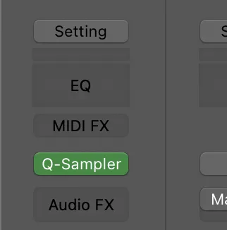

Making beats in other DAWs like FL Studio is straightforward. FL Studio has the channel rack and a wide library in the cloud of one shots you can use. Yet, at least for me, it seemed complicated and manual in Logic. But, there are actually some hidden gems that can save you a lot of time.

Before learning these tricks, I’d always end up slicing and arranging loops myself. With these tips you'll be off to the races to create beats and start being creative faster.

## Getting Started

The key to this is the Quick Sampler. Create a new software instrument track. Then change the instrument to the Quick Sampler.

## Setup

To make it easy, find a beat you enjoy from the Apple Loop Library and drag it into your project. This will make it match the key and BPM of the project!

Next, open the Quick Sampler. Do this by hovering the instrument and clicking the icon in the center.

Drag your sample from the track grid into the Quick Sampler, choosing "Optimized" on the right.

After you've dragged in your sample, head over to the "Slice" tab.

As you can see, the Quick Sampler auto detects unique sounds and transients. It slices the audio into separate sounds. You can even play these by using `command` + `k` to open the keyboard! Or you could use a MIDI keyboard!

## Making a Beat

Now, here you could honestly freestyle by playing some music and using your keyboard to create a beat you'd like. This is because the Quick Sampler has already sliced everything.

The way I'm going to show is akin to FL Studio's channel rack. Right click in the track grid on the Quick Sampler track and select "Create Pattern Region." You'll notice this open's the editor where you'll be able to draw your pattern!

I'll usually set this to "16 Steps" so you can see all 16th notes possible in a measure but you could add more. You'll also notice that the Quick Sampler separates each sound.

## Non Apple Loop Library Beats / One Shots

For non Apple Loop Library beats you'll have to import them into Logic. Then, to make them a real loop (that'll adjust to the bpm and key) [you can follow this guide I made](/blog/audio-file-speed-slow)!

## Conclusion

Get out there and make some beats!
