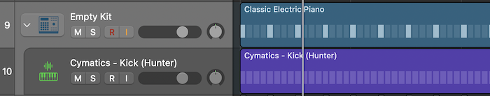
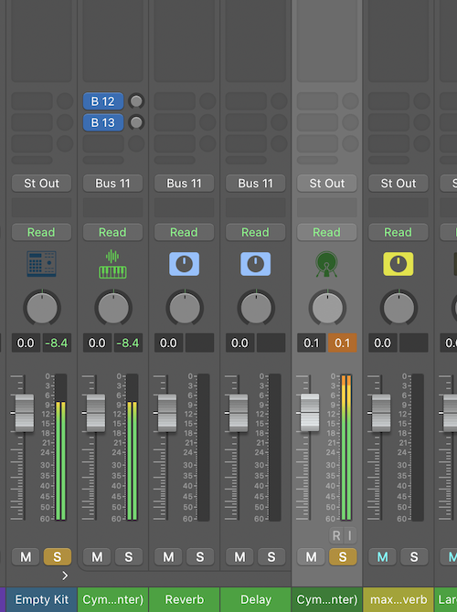
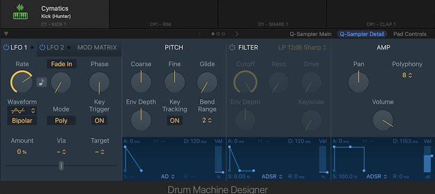
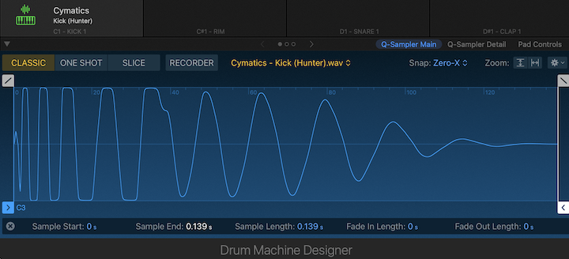
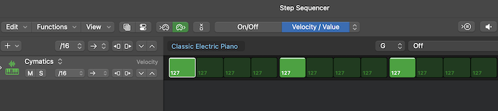

## Setup

- Create a new software instrument track.
- In the Inspector, select **Drum Machine Designer**.
- Right-click in the right area and create a **Pattern Region**.
- Open Drum Machine Designer and drag a sample into it.

Now we can compare using Drum Machine Designer to using the raw sample.

## Making Raw Samples and DMD Samples Match

From the video linked in the Resources section, Chris starts by answering whether there's a difference between raw samples and using them in Drum Machine Designer with:

> "Not really, no... kinda!"

**But in reality, there is a difference!**

They go on to explain that samples imported into Drum Machine Designer are significantly lower in decibel level. In the example, the raw sample was hitting around `0 dB`, whereas after being imported into Drum Machine Designer, it was hitting around `-8 dB`.

Take a look at the picture below:

The kick sample I imported from a sample pack is hitting `0.1 dB`, while the same sample dragged into Drum Machine Designer is only hitting `-8.4 dB`!  

Last I checked, that’s a big difference.

So, how do we fix this? Here's how:

- Open Drum Machine Designer.
- Go to the **Q-Sampler Detail** page.
- Set the Volume knob in the **Amp** section to `0` (you can reset it quickly with `Option` + `Click`).
- In the **Filter** section, turn off the filter.

- Go to the **Q-Sampler Main** page:  
  - Sometimes Q-Sampler trims the sample, so drag it out fully.

- Open the **Step Sequencer** and set the velocity of every note to `127` (full velocity).  
  *(Click and drag up on the arrow to increase velocity.)*

To double-check, set the raw sample and the Drum Machine Designer version to opposite polarities, open a MultiMeter on the Stereo Out, and check the Goniometer in the MultiMeter with a large upper and lower range.

**Note:** If you drag a sample from Finder or the Files app, you can skip the Q-Sampler Main Page step, because it won’t have extra space at the end of the sample.

## Conclusion

Using the Step Sequencer lets you build beats faster. Hopefully, this clears up how to use Drum Machine Designer effectively.
