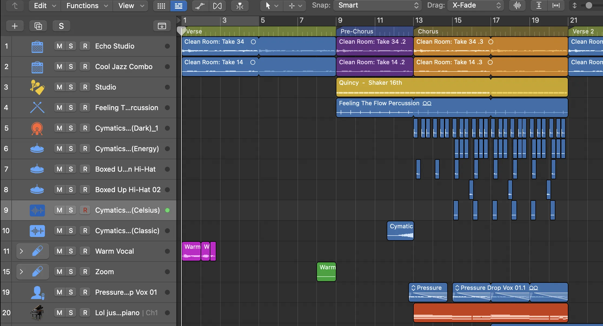

The rule of two loops is an arrangement rule that will help you create powerful arrangements. It also helps eliminate the challenge of not knowing what to do next when you have a starting point (loop, chords, riff, beat, etc.).

We start with a loop. Let's say a guitar riff and chords. We repeat that loop twice and then we have to change it up. Our ears naturally expect songs to change every two loops of the main instruments. You can even color code things to make it more apparent in your Logic where those two loops are.

Two loops in, we need to change something: add an instrument, add expression to an existing instrument, reduce expression to an existing instrument, or remove an instrument. For us, let's add in a shaker in the background.

It is to be noted there are two sides to every transition:

1. Entry Point (Leading up to the main transition):

   - The buildup or preparation leading to a significant change or transition in the music.
   - Increasing tension, adding new instruments, or altering the rhythm to create anticipation.

2. Main Transition (Right at the beginning of the new loop start):

   - Point where the actual transition occurs, marking the shift from one section of the music to another (e.g., from a verse to a chorus).
   - It's often a critical moment in the composition, and the transition could be achieved through changes in melody, harmony, rhythm, or instrumentation.

3. Exit Point:
   - Conclusion of the transition, settling into the new musical section.
   - Make a smooth flow and coherence in the music, allowing a natural progression.

You could use various techniques to enhance these points in a transition. For example:

- Adding a drum fill or a riser leading up to the main transition to build energy.
- Introducing a new chord progression or melodic motif at the main transition to signal a change.
- Using effects like filters or reverbs to create a sense of space and transition.

## Cool tricks

- Adding a counter melody may also help the main melody not exhaust.
- Right before you cut out all instruments to go back to none in a two-loop transition, cut out everything. Then, add in like a little drum fill and a crash/boom one-shot or something for one measure.

## Arrange things how you'd like

It all depends on the genre you're dealing with. For example, in EDM, you build up to a drop. In pop, you have (Verse/Prechorus/Chorus then Verse/Prechorus/Chorus/Bridge/Chorus).

## Example

A really great example of this would be Lady Gaga's first album, The Fame. It's a near-perfect album of 2000s Europop. With most songs, you can break each section (verse, prechorus, etc.) into “couplets." Every chord loop, bassline loop, or vocal melody, happens twice so the listener can learn it before switching. Songs like “Poker Face” or “Just Dance” truly are masterclasses on this.
